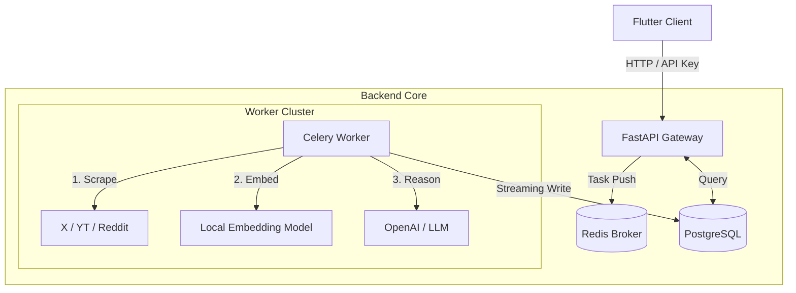

# 🧠 AI Public Opinion - 全栈智能舆情分析系统

<div align="center">


**多源采集 · 语义去重 · 情感计算 · 自动脑图**

[核心特性](#-核心特性) • [系统架构](#-系统架构) • [快速开始](#-快速开始) • [技术文档](docs/技术框架说明.md)

</div>

---

**AI Public Opinion** 是一个生产级的开源舆情分析平台。它不仅是一个数据采集器，更是一个能够“思考”的分析师。通过整合 **Playwright 爬虫**、**本地 Embedding 模型** 和 **云端 LLM**，它能够从嘈杂的社交媒体噪音中提炼出结构化的核心观点。


*(系统仪表盘预览)*

## ✨ 核心特性

### 🌐 全网多源采集
*   **X (Twitter)**: 突破性的 **Cookie 轮询账号池** 设计，支持自动滚动、评论递归抓取，具备工业级抗反爬能力。
*   **YouTube**: 创新性利用 **字幕 (Transcript)** 进行分析，避开了昂贵的音视频处理成本。
*   **Reddit**: 双模采集引擎（官方 API + HTTP 降级），确保数据获取的高可用性。

### 🧠 深度 AI 分析管道
*   **智能采样 (Smart Sampling)**: 面对数万条评论，使用本地向量模型 (`E5`) 进行语义聚类与去重，筛选出 Top-N 最具代表性的观点。
*   **自愈式 LLM 交互**: 内置 **JSON Repair** 机制，当大模型输出格式错误时，自动构造 Prompt 进行自我修正。
*   **动态热度算法**: 引入 **半衰期 (Half-Life)** 概念，精准计算话题的时效性热度。

### 📊 现代化交互体验
*   **Flutter 全平台**: 一套代码同时支持 Web、Windows 和 Android。
*   **Mermaid 思维导图**: 自动将分析结果转化为可交互的思维导图。
*   **实时进度**: WebSocket/轮询 实时反馈任务采集与分析进度。

---

## 🏗️ 系统架构

系统采用微内核单体架构，计算与 IO 分离。



👉 **查看详细架构设计**: [技术框架说明 (Technical Whitepaper)](docs/技术框架说明.md)

---

## 🚀 快速开始

### 方式一：Docker 一键部署 (推荐)

无需本地安装 Python、PostgreSQL 或 Redis，只需安装 Docker。

```bash
# 1. 配置环境变量
cd backend
cp .env.example .env
# 编辑 .env 填入 LLM_API_KEY 等信息

# 2. 启动后端服务集群
cd ..
docker-compose up -d --build

# 3. 执行数据库迁移
docker-compose exec api alembic upgrade head

# 4. 查看日志
docker-compose logs -f
```

*后端启动后，请参考下文启动 Flutter 前端。*

### 方式二：本地开发部署

#### 1. 后端部署

```bash
cd backend

# 1. 创建虚拟环境
python -m venv venv
source venv/bin/activate  # Windows: venv\Scripts\activate

# 2. 安装依赖
pip install -r requirements.txt
playwright install chromium

# 3. 配置环境
cp .env.example .env
# ⚠️ 务必修改 .env 中的数据库、Redis 和 LLM_API_KEY 配置

# 4. 初始化数据库
alembic upgrade head

# 5. 启动服务 (建议开启两个终端)
# Terminal A: API 服务
uvicorn app.main:app --reload --host 0.0.0.0

# Terminal B: Celery Worker
# Windows 用户请使用 -P solo
celery -A app.workers.celery_app worker --loglevel=info -P solo
```

### 2. 前端运行

```bash
cd frontend

# 1. 安装依赖
flutter pub get

# 2. 运行 (Web 或 Windows)
flutter run -d chrome
# 或
flutter run -d windows
```

---

## ⚙️ 核心配置说明 (.env)

| 变量名 | 说明 | 示例值 |
| :--- | :--- | :--- |
| `API_KEY` | 后端 API 访问密钥 (请求头使用 `Authorization: Bearer <key>`) | `secret-key-123` |
| `LLM_MODEL` | 使用的大模型名称 | `gpt-4-turbo` / `deepseek-chat` |
| `X_ACCOUNTS_JSON` | X 平台 Cookie 池 (JSON) | `[{"cookies": [...]}]` |
| `SEMANTIC_SAMPLING_MODEL` | 本地 Embedding 模型 | `intfloat/multilingual-e5-small` |

---

## 📚 文档导航

我们为您准备了详尽的工程文档，帮助您深入理解系统内部原理：

*   **📘 [技术框架说明](docs/技术框架说明.md)**
    *   包含：系统设计原则、Micro-kernel 架构解析、数据库 Schema 设计。
*   **🕷️ [数据采集技术内幕](docs/数据采集.md)**
    *   包含：X (Twitter) 账号池与反爬策略、YouTube 字幕切片算法、Reddit 双模采集引擎。
*   **🧠 [AI 分析深度指南](docs/AI分析.md)**
    *   包含：Prompt Engineering 细节、流式数据清洗、Embedding 智能采样算法、LLM 自愈机制。
*   **🛠️ [完整运行与部署指南](docs/运行说明.md)**
    *   包含：API Key 获取教程（X Cookie/YouTube API）、环境搭建步骤、生产环境配置建议。

---

## 🤝 贡献指南

我们欢迎任何形式的贡献！
1.  Fork 本仓库
2.  创建特性分支 (`git checkout -b feature/AmazingFeature`)
3.  提交更改 (`git commit -m 'Add some AmazingFeature'`)
4.  推送到分支 (`git push origin feature/AmazingFeature`)
5.  提交 Pull Request

## 📄 许可证

本项目基于 [MIT License](LICENSE) 开源。